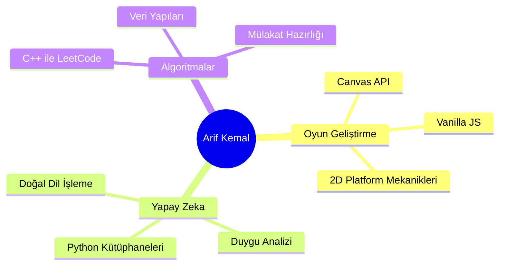

<div align="center">

[](https://git.io/typing-svg)

📍 Bursa / Türkiye &nbsp;·&nbsp; 🎓 Bilgisayar Mühendisliği &nbsp;·&nbsp; 💡 Veri Yapıları · Yapay Zeka · Algoritmalar

</div>

---

## 🧩 Hakkımda

```
🤖  Python ile NLP ve duygu analizi üzerine çalışıyorum
⚙️  C++ ile algoritma ve veri yapıları pratiği yapıyorum
♟️  Satranç oynuyorum ve satranç platformu geliştirdim
📚  Her gün yeni bir şeyler öğrenmeye çalışıyorum
🎮  Canvas & Vanilla JS ile oyun geliştiriyorum
```

---

## 🛠️ Teknolojiler & Araçlar

<div align="center">

### Diller
[](https://www.java.com/)
[](https://isocpp.org/)
[](https://developer.mozilla.org/en-US/docs/Web/JavaScript)
[](https://www.python.org/)
[](https://isocpp.org/)
[](https://developer.mozilla.org/en-US/docs/Web/HTML)
[](https://developer.mozilla.org/en-US/docs/Web/CSS)
 
### Araçlar & Platformlar
 
[](https://www.linux.org/)
[](https://docs.docker.com/)
[](https://git-scm.com/doc)
[](https://code.visualstudio.com/docs)

</div>

---
<div align="center">

### 🏆 GitHub Başarı Kupalarım
[](https://github.com/ryo-ma/github-profile-trophy)

</div>

---

## 📊 GitHub İstatistiklerim

<div align="center">

  
  &nbsp;&nbsp;
  

</div>

<br>

<div align="center">

  <a href="https://git.io/streak-stats">
    
  </a>

</div>

---

## 🚀 Öne Çıkan Projeler

<div align="center">

| Proje | Açıklama | Teknoloji |
|-------|----------|-----------|
| [🧠 Hackathon-Yorum-Analizi](https://github.com/Arif-kemal/Hackathon-Yorum-Analizi) | Doğal dil işleme ve duygu analizi odaklı hackathon projesi |  |
| [🎮 Holomony_itch.io](https://github.com/Arif-kemal/Holomony_itch.io) | Matris tabanlı harita rotasyon mekaniklerine sahip 2D platform bulmaca oyunu |  |
| [⚙️ Leetcode](https://github.com/Arif-kemal/Leetcode) | Kodlama mülakatlarına hazırlık için C++ ile çözülmüş algoritma koleksiyonu |  |
| [♟️ chess_website](https://github.com/Arif-kemal/chess_website) | Tarayıcı üzerinde çalışan dinamik satranç platformu |  |

</div>

---

## 🎯 Odak Alanlarım

<div align="center">



</div>

---

<div align="center">

  


</div>
